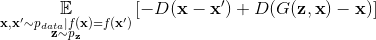
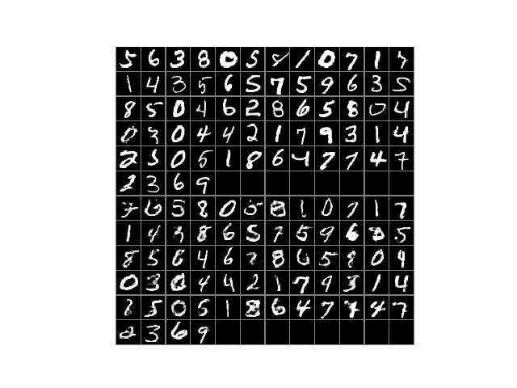

# Labelless Conditional GAN

Typically, conditional image synthesis with a generative adversarial network (GAN) is achieved by providing the generator a class label. This code implements a novel (to my knowledge) GAN loss function that allows for image synthesis conditioned on a raw input image. In detail, the GAN is provided both sampled noise and an image to condition on. The noise is up-sampled as usual while the image is down-sampled and the resulting hidden representations are concatenated. But for any standard GAN loss, if the generator is provided a real sample, it will simply output the provided sample unless the downsampling removes enough important bits. As such, consider the following modification of the hinge loss,  



Let us break down this loss function. The second term in the above equation is the discriminator evaluated on the residual between the generator's output and its provided real sample. In the standard hinge loss, this term would instead be the discriminator evaluated on the generator's output, which may lead to the generator acting as an identity function. However, if the generator is acting as an identity function, then the residual between its output and input is zero. Hence there is a very clear signal of such undesired behavior. The first term is the discriminator evaluated on the residual between two random samples of the same class. This would be the discriminator evaluated on a single real sample in the typical hinge loss. The residual of two random samples from the same class is non-zero with high probability for real world datasets like MNIST, hence the generator cannot act as an identity function or it will be easily identified by the discriminator. Instead, the generator must produce what appears to be a random sample from the same class as its provided, real input.
  
Below is a sample of input images to the generator, and corrosponding output images, where the generator was trained for 10000 updates. The input images were part of a test set, and so, were not seen by the generator during training. We see that the generator largely succeeds at producing a sample from the same class as the input, and without acting as an identity function, though it is not perfect and produces some artifacts. A higher capacity GAN, longer training, and better tuned hyper-parameters would likely improve sample quality.
  


## Prerequisites

python (3.6.1)  
tf-nightly-gpu (1.13.0.dev20190221)  
numpy (1.12.1)  
scikit-learn (0.18.1)  

Note: Newer versions of scikit-learn will raise an error as it is no longer possible to pass a 1D array to one-hot encoder.

## Running the Code

To run the code, enter

```
python SemiConditionalGAN.py --args
```

where possible args are

```
--noise_dim: The dimensionality of the sampled noise provided to the generator.
--noise_type: The type of noise. Choose between uniform, normal, or truncated.
--loss_type: The loss type. Choose between KL, wasserstein, or hinge.
--batch_size: The batch size.
--num_steps: The total number of updates.
--show_images: Bool. If True, images on test data will be shown every 2500 updates.
--save: Bool. If true, the model will be preiodically saved.
```
## Credits

The arch_ops and losses files are modified from https://github.com/google/compare_gan.  
The make_montage file used to display a collection of images as a montage follows Parag Mital's concise implementation (see https://github.com/pkmital/CADL). 
